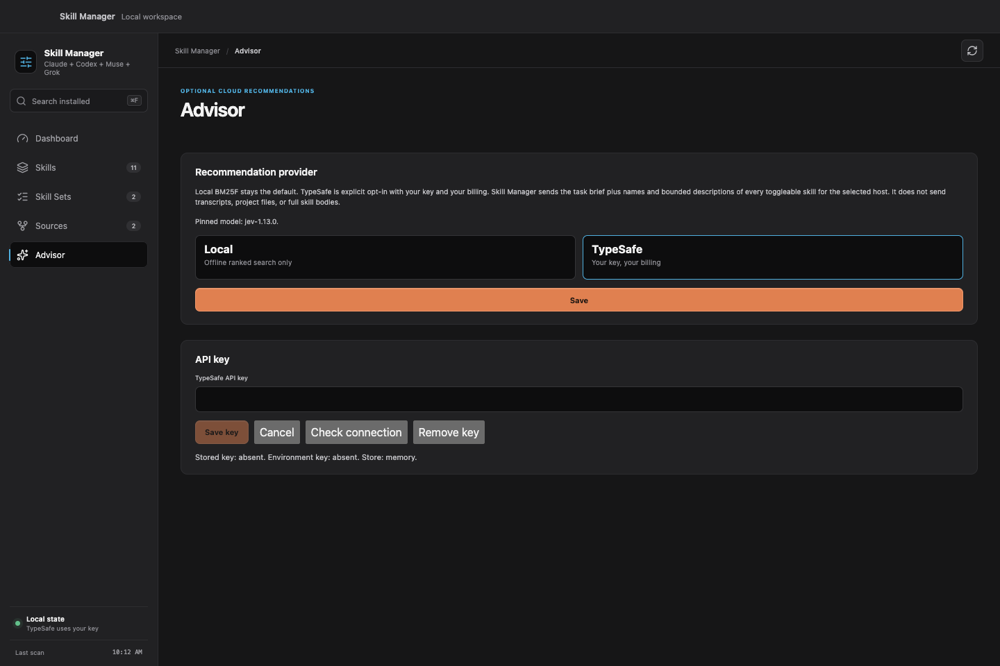

# Skill Manager

See which skills your AI coding tools can use, and turn them on or off without
deleting them.

<p align="center">
  
</p>

<p align="center">
  <a href="#quick-start">Download macOS app</a>
  ·
  <a href="#how-it-works">How it works</a>
  ·
  <a href="#skill-advisor">Skill Advisor</a>
  ·
  <a href="#cli--tui">CLI &amp; TUI</a>
  ·
  <a href="#documentation--support">Documentation</a>
</p>

Skill Manager is a local app for managing **Claude Code, Codex, Muse, and Grok**
skills on macOS. A skill is a folder of reusable instructions for an agent,
described in a `SKILL.md` file.

- **See skills across tools:** find what is enabled and where each skill came
  from in one view.
- **Choose what is available:** stage individual or group toggles, review the
  changes, and apply them together. Restore a disabled skill when you need it.
- **Keep combinations for each task:** save Skill Sets for recurring work and
  star favorite skills to find them again.
- **Ask an agent which skills to use:** Skill Advisor inspects installed
  skills, temporarily enables a small relevant set, and turns those skills
  back off. Optional TypeSafe Jev recommendations use your API key after you
  opt in.

## Quick start

**Requirements:** an Apple Silicon (M-series) Mac running macOS 13 or newer.
The current source version is `0.9.0`. This is a **public preview**.

### 1. Download and verify

Save both files from the [v0.9.0 release](https://github.com/dees91/agent-skill-manager/releases/tag/v0.9.0)
to your Downloads folder:

- [Download the macOS app](https://github.com/dees91/agent-skill-manager/releases/download/v0.9.0/skill-manager-desktop-0.9.0-macos-arm64.zip)
  (`skill-manager-desktop-0.9.0-macos-arm64.zip`).
- [Download SHA256SUMS.txt](https://github.com/dees91/agent-skill-manager/releases/download/v0.9.0/SHA256SUMS.txt)
  to verify the archive.

Open Terminal and run:

```bash
cd "$HOME/Downloads"
grep 'skill-manager-desktop-0.9.0-macos-arm64.zip$' SHA256SUMS.txt \
  | shasum -a 256 -c -
```

Continue only if the archive is reported as `OK`. This checks the download
against the release checksum.

### 2. Install the app

Double-click the ZIP to expand it, then drag **Skill Manager.app** into
**Applications**.

### 3. Open the app

Open **Skill Manager** from Applications.

The preview is ad-hoc signed, but **not Developer ID signed or notarized**.
If macOS says the developer cannot be verified or Apple cannot check the app,
open **System Settings → Privacy & Security → Open Anyway**, then confirm
**Open**, after verifying the source and checksum. This option appears after
an attempted launch; see [Apple's first-launch guidance](https://support.apple.com/en-us/102445).

### 4. Try a reversible toggle

Open **Skills**. Your existing globally installed skills appear automatically.

1. Click an **ON** cell for a skill and tool you use. The change is now pending.
2. Review the pending change and choose **Apply changes**. The cell becomes
   **OFF**.
3. Click the **OFF** cell and **Apply changes** again to restore it.

Start a new session in your coding tool after applying changes so it detects
the updated skills.

**No skills yet?** Open **Sources → Install source** and choose a Git repository
or a local folder containing skills. Select the skills and tools, review the
proposed links, then install. Git source operations require Git. The
[source guide](https://github.com/dees91/agent-skill-manager/blob/main/docs/usage.md#install-and-maintain-sources)
walks through this flow.

## How it works

Skill Manager scans the global skill folders used by your coding tools. When
you apply a disable, it moves the original folder or link into its own storage
under `~/.skill-manager/disabled/`. Enabling moves that same entry back to its
original location. The toggle preserves the skill's contents and installation
method.

Changes in Skills are staged until you choose **Apply changes**. If restoring
a skill would overwrite something, Skill Manager reports a conflict and leaves
the blocker in place. Installing, updating, repairing, or uninstalling a source
uses a separate confirmation flow.

<p align="center">
  <a href="docs/images/skills.png"></a>
</p>

Active skills stay visible; available skills are grouped by source below them.
Each tool has its own ON/OFF state.

**Sources** installs skills from Git repositories or links to local folders.
**Skill Sets** saves combinations you can stage for a chosen tool.
**Dashboard** shows an overview and approximate skill-catalog context use.
**Advisor** opts in to TypeSafe Jev recommendations.

See the [desktop guide](https://github.com/dees91/agent-skill-manager/blob/main/docs/usage.md#desktop-interface)
for these workflows and favorites. The [Skill Advisor](#skill-advisor) section
covers the first-party skill and TypeSafe opt-in.

Management covers user skills in the
[supported global folders](https://github.com/dees91/agent-skill-manager/blob/main/docs/usage.md#paths-skill-manager-uses).
Codex system skills and Claude plugin-cache skills can be shown read-only;
plugin toggles and project-level skill folders are outside the current scope.
The experimental skills.sh Discover screen is not included in this preview.

## Skill Advisor

Install the optional first-party
[`skill-advisor`](https://github.com/dees91/agent-skill-manager/blob/main/skills/skill-advisor/SKILL.md)
so a coding agent can inspect locally installed skills for the current Claude
Code, Codex, Muse, or Grok host, temporarily enable at most five that match
the task, and clean up that activation when it finishes. It needs no plugin
or provider hook.

Local ranked search is the default and stays offline. Open **Advisor** in the
app, or run `skill-manager advisor provider use typesafe`, to opt in to
[TypeSafe](https://typesafe.ai) Jev recommendations with a key you own.
A stored or environment key does not enable cloud use by itself. Jev then
sees names and short descriptions of every toggleable skill for that host,
not only a local shortlist.

<p align="center">
  <a href="docs/images/advisor-typesafe.png"></a>
</p>

The [Skill Advisor guide](https://github.com/dees91/agent-skill-manager/blob/main/docs/usage.md#first-party-skill-advisor)
covers install, CLI commands, and what is sent on a recommendation request.

## CLI & TUI

The command-line tool (CLI) also includes an interactive terminal interface
(TUI). Install the separate archive using the
[CLI installation guide](https://github.com/dees91/agent-skill-manager/blob/main/docs/usage.md#install-cli).
Both follow the same filesystem safety rules as the app.

```bash
skill-manager            # Open the interactive TUI
skill-manager list       # List skills and tool states
skill-manager status     # Show ON, OFF, conflict, and read-only counts
```

In the TUI, use **Tab** to choose a tool, **Space** to stage a toggle, and
**Enter** to apply it. Mutating CLI commands offer `--dry-run` previews.

See [commands and keyboard controls](https://github.com/dees91/agent-skill-manager/blob/main/docs/usage.md#terminal-interface)
for source management and advanced use, including
[Skill Advisor](#skill-advisor) CLI commands.

## Documentation & support

- [User guide](https://github.com/dees91/agent-skill-manager/blob/main/docs/usage.md):
  GUI workflows, CLI installation, commands, Skill Advisor, paths, and safety.
- [Troubleshooting](https://github.com/dees91/agent-skill-manager/blob/main/docs/usage.md#troubleshooting)
  and [compatibility](https://github.com/dees91/agent-skill-manager/blob/main/docs/usage.md#status-and-compatibility).
  Release binaries support Apple Silicon macOS; other platforms are unvalidated.
  Universal binaries, DMG installers, and auto-update are not available.
- [Releases](https://github.com/dees91/agent-skill-manager/releases) for changes
  and downloads.
- [Issues](https://github.com/dees91/agent-skill-manager/issues) for bugs and
  feature requests; use [private vulnerability reporting](https://github.com/dees91/agent-skill-manager/security/advisories/new)
  for security issues.
- [Contributing](https://github.com/dees91/agent-skill-manager/blob/main/CONTRIBUTING.md)
  for source builds and checks. The
  [engineering wiki](https://github.com/dees91/agent-skill-manager/blob/main/docs/wiki/index.md)
  and [agent brief](https://github.com/dees91/agent-skill-manager/blob/main/AGENTS.md)
  document the implementation and product contract.

Support covers the current public preview and `main` on a best-effort basis,
without a guaranteed response or remediation time.

## License, privacy & notices

Skill Manager is available under the [MIT License](LICENSE). Binary
distributions include [third-party license notices](THIRD_PARTY_NOTICES.txt).

The app stores its state locally and has no account system, telemetry,
analytics, crash reporting, or background polling. Explicit Git source
operations use the network. Optional TypeSafe recommendations send a task brief
and bounded skill names/descriptions to `api.typesafe.ai` only after the user
opts in and supplies their own key. Optional provider diagnostics invoke
installed Claude/Codex tools, whose own behavior and privacy terms also apply.
Read the
[privacy policy](https://github.com/dees91/agent-skill-manager/blob/main/PRIVACY.md)
for data access, storage, and removal.

Third-party skills contain instructions an agent may follow. Skill Manager
does not audit or sandbox them; review a source before installing its skills.
See the [security policy](https://github.com/dees91/agent-skill-manager/blob/main/SECURITY.md)
for security boundaries and reporting.
