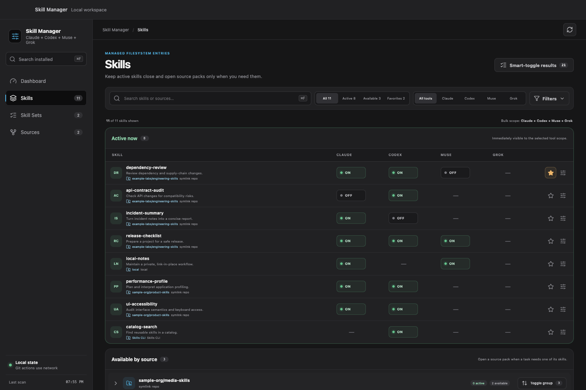
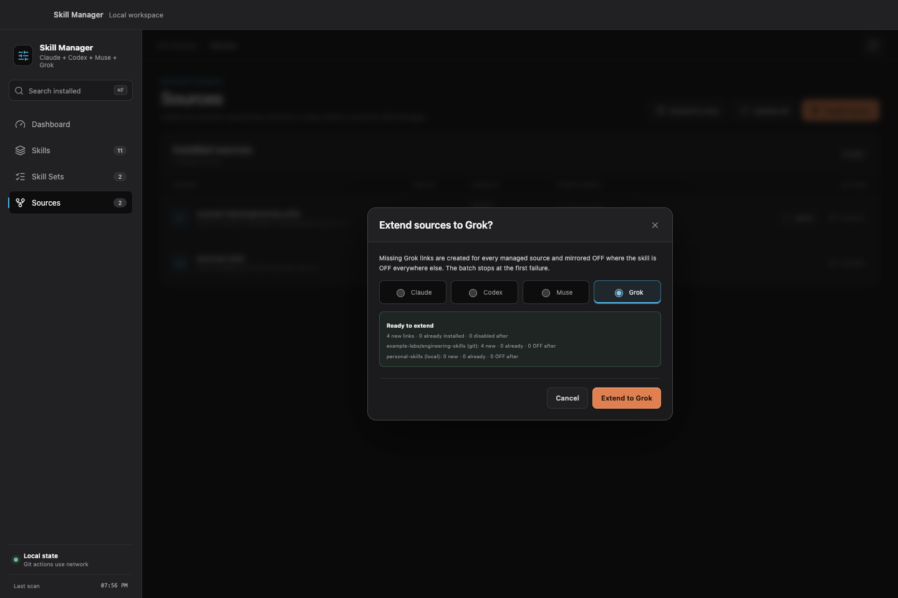

# Skill Manager

Skill Manager gives Claude Code, Codex, Muse, and Grok users one local inventory
for Agent Skills. You can install skills, see where each one came from, and
turn it off without deleting or rewriting it. Turn it back on and Skill
Manager restores the original directory or symlink.

<p align="center">
  <a href="https://github.com/dees91/agent-skill-manager/releases/tag/v0.6.0">Download macOS app</a>
  ·
  <a href="#installation-from-source">Install CLI</a>
  ·
  <a href="#status-and-compatibility">Compatibility</a>
</p>

<p align="center">
  
</p>

## What Skill Manager does

- Scans Claude Code, Codex, Muse, and Grok to build one live skill inventory.
- Moves the exact original skill entry when you turn a skill off or on.
- Leaves Git repositories, linked folders, lockfiles, and skill contents alone.
- Uses the same safety rules in the macOS app, TUI, and CLI.
- Runs locally, without telemetry or background polling.

## Status and compatibility

The current source version is `0.6.0`. It is a public preview, not a stable
release.

- The desktop app supports Apple Silicon Macs running macOS 13 or newer.
- The Go CLI and TUI can compile on other platforms, but the release contract
  does not yet cover filesystem behavior outside macOS.
- Skill Manager uses fixed provider paths under the current user's home
  directory. This version cannot use custom Claude, Codex, Muse, or Grok skill
  roots.
- Release downloads are built for Apple Silicon and ad-hoc signed. They are not
  Developer ID signed or notarized.
- The preview does not include universal macOS binaries, DMG installers,
  auto-update, or telemetry.

## Paths Skill Manager uses

Skill Manager derives these paths from the current OS user's home directory:

| Purpose | Path | Behavior |
|---|---|---|
| Claude user skills | `~/.claude/skills` | Toggleable |
| Codex user skills | `~/.agents/skills` | Toggleable |
| Muse user skills | `~/.config/muse/skills` (`$XDG_CONFIG_HOME/muse/skills` when set) | Toggleable |
| Grok user skills | `~/.grok/skills` | Toggleable |
| Codex system skills | `~/.codex/skills/.system` | Read-only |
| Claude plugin cache | `~/.claude/plugins/cache` | Read-only |
| Skills CLI metadata | `~/.agents/.skill-lock.json` | Read-only source label |
| Skill Manager state | `~/.skill-manager` | Owned by Skill Manager |

Skill Manager hides entries that lack a regular `SKILL.md`. It rescans the
filesystem at startup, after a mutation, and when you refresh. The manifest
records ownership and restoration data; it does not replace live discovery.

## Installation

### GitHub release preview

The [`v0.6.0` prerelease](https://github.com/dees91/agent-skill-manager/releases/tag/v0.6.0)
contains two Apple Silicon downloads:

- `skill-manager-desktop-0.6.0-macos-arm64.zip` contains `Skill Manager.app`;
- `skill-manager-cli-0.6.0-macos-arm64.tar.gz` contains the terminal binary,
  README, license, and third-party notices.

Download the archive you want and `SHA256SUMS.txt`, then compare the archive's
SHA-256 digest with its line in the manifest:

```bash
shasum -a 256 skill-manager-desktop-0.6.0-macos-arm64.zip
grep 'skill-manager-desktop-0.6.0-macos-arm64.zip' SHA256SUMS.txt
```

The hashes must match. This catches an incomplete or changed download; it does
not provide a Developer ID signature or notarization ticket.

To install the desktop app, expand the ZIP and move `Skill Manager.app` to
`/Applications`. macOS may block the first launch because the preview is not
notarized. Control-click the app, choose **Open**, then confirm **Open**. If
macOS does not offer that option, try one normal launch and open **System
Settings → Privacy & Security → Open Anyway** only after you have verified the
checksum and source.

To install the CLI, extract the archive and place the executable on `PATH`:

```bash
tar -xzf skill-manager-cli-0.6.0-macos-arm64.tar.gz
install -m 0755 \
  skill-manager-cli-0.6.0-macos-arm64/skill-manager \
  "$HOME/.local/bin/skill-manager"
skill-manager --version
```

### Installation from source

The terminal application requires Go 1.26.6 or newer:

```bash
go install github.com/dees91/agent-skill-manager@latest
```

You can also clone the repository and build it locally:

```bash
git clone https://github.com/dees91/agent-skill-manager.git
cd agent-skill-manager
make build
./bin/skill-manager help
```

`make dev` installs the current checkout at
`~/.local/bin/skill-manager`. Set `BIN` to install somewhere else:

```bash
make dev BIN="$HOME/bin/skill-manager"
```

### Building the desktop app

The desktop build requires Go 1.26.6 or newer, Node.js 22.12 or newer with npm
10 or newer, Xcode command-line tools, and network access while dependencies
are installed:

```bash
make gui-test
make gui-build
open "desktop/build/bin/Skill Manager.app"
```

This produces a local ad-hoc-signed `darwin/arm64` app. macOS may ask you to
approve it before the first launch because it is not notarized.

## Terminal interface

Run Skill Manager without a subcommand to open the TUI:

```bash
skill-manager
skill-manager tui
```

Inspect the current installation with read-only commands:

```bash
skill-manager version
skill-manager list
skill-manager list --json
skill-manager list --json --available-for codex --query video --query remotion
skill-manager advisor search --tool codex --query "video remotion rendering"
skill-manager status
skill-manager groups
skill-manager repos
```

Preview a change with `--dry-run`, then toggle one managed skill:

```bash
skill-manager disable --tool claude example-skill --dry-run
skill-manager disable --tool claude example-skill
skill-manager enable --tool claude example-skill
```

Install every valid skill from a Git repository, or select exact skills and
tools:

```bash
skill-manager install https://github.com/example/agent-skills --dry-run
skill-manager install https://github.com/example/agent-skills --tool both
skill-manager install git@github.com:example/agent-skills.git --tool codex --skill example-skill
```

Install a user-owned folder as live, in-place links:

```bash
skill-manager install ~/Developer/example-skills --tool both
skill-manager install ./skills --tool claude --skill example-skill --dry-run
```

Update a recorded Git source or uninstall a complete recorded source:

```bash
skill-manager update --dry-run
skill-manager update https://github.com/example/agent-skills
skill-manager uninstall https://github.com/example/agent-skills --dry-run
skill-manager uninstall ~/Developer/example-skills --dry-run
```

Git updates are fast-forward-only and require a clean, audited checkout. Local
path sources are live links, so they do not need an update operation. Uninstall
removes a complete recorded source; Skill Manager does not uninstall one skill
from a source at a time.

Link every recorded source to one more tool, mirroring ON/OFF state, without
reinstalling each source:

```bash
skill-manager extend --tool muse --dry-run
skill-manager extend --tool muse
```

Extend processes sources in manifest order and stops at the first failure,
keeping earlier sources extended. The desktop Sources screen offers the same
bulk action as "Extend to tool". Start a new session afterwards so the added
tool picks up the new skills.

### First-party Skill Advisor

The current source build includes the optional
[`skill-advisor`](skills/skill-advisor/SKILL.md). Before a non-trivial task, it
can inspect locally installed skills and report the smallest clearly relevant
set in two groups: already active and needing activation. It selects at most
five total for the current Claude Code, Codex, Muse, or Grok host, activates the OFF
skills, and returns an opaque receipt when it owns or shares a lease. The
agent cleans that exact receipt itself before its final response. It needs no
plugin or provider hook.

After reviewing the skill instructions, install it for all tools from the
public repository:

```bash
skill-manager install https://github.com/dees91/agent-skill-manager \
  --tool both --skill skill-advisor
```

Contributors can link the current checkout instead:

```bash
skill-manager install . --tool both --skill skill-advisor --dry-run
skill-manager install . --tool both --skill skill-advisor
```

The skill uses a versioned, path-free inventory and receipt API:

```bash
skill-manager advisor status --tool codex --json
skill-manager advisor search --tool codex \
  --query "video remotion ffmpeg animation rendering" --limit 20 --json
skill-manager advisor activate --tool codex --skill example-skill --json
skill-manager advisor cleanup --receipt <receipt-id> --json
```

`advisor search` ranks only the selected host's toggleable ON and OFF skills.
It uses deterministic local weighted BM25F across name, description, group, and
source metadata, with exact-phrase bonuses and bounded fuzzy token matching.
The default result limit is 20 and the accepted range is 1-50. Search does not
use a model, embeddings, an API, a cache, or a persistent index. The query stays
in process memory; JSON results omit it along with filesystem paths, matching
reasons, and numeric scores.

`activate` accepts one tool and 1-5 unique skill names. The advisor reports the
selected names as already active or needing activation before it calls the API.
Skills that were already ON remain user-owned. Several receipts may share one
advisor-enabled skill; the skill returns to OFF only when the final receipt is
cleaned up. The advisor reads every selected `SKILL.md`, including those already
ON, so the current task does not depend on a provider catalog refresh. Before a
normal final response, the agent cleans the exact receipt created by its own
invocation instead of asking the user to paste a command. If cleanup fails, it
preserves and reports the receipt and recovery command. It never infers that an
unknown receipt is stale.
If a provider cannot see a newly installed advisor, start a new provider
session.

The older `list --json --query` flags remain unchanged as case-insensitive OR
substring filters across skill name, description, group, and source. They are a
general inventory surface, not the advisor's ranking mechanism.

The skill source and CLI API can change at different times on `main`. Before it
selects or mutates anything, it checks for `apiVersion: 1` and the
`ranked_search_v1` capability. A missing capability fails with an upgrade
message; the skill does not fall back to substring lookup.

### TUI controls

| Key | Action |
|---|---|
| `Tab` | Switch active tool column |
| `Up`/`Down` or `k`/`j` | Move selection |
| `Space` | Stage or unstage the active-cell toggle |
| `b` | Smart-toggle all tool cells in the row |
| `g` | Smart-toggle the selected source group |
| `A` | Smart-toggle all visible eligible cells |
| `G` | Cycle group filter |
| `/` | Edit text filter |
| `s` | Cycle source filter |
| `o` | Show or hide read-only skills |
| `d` | Show or hide details |
| `u` / `U` | Undo one / clear all pending changes |
| `a` or `Enter` | Apply the pending batch |
| `r` | Rescan |
| `q` | Quit, with a warning for pending changes |

## Desktop interface

The macOS source build uses the same Go domain services as the CLI and TUI. It
has four views:

- **Dashboard** shows managed visibility, groups, conflicts, and an approximate
  global skill-catalog context budget for each provider.
- **Skills** keeps active skills open, groups inactive skills by source, stores
  favorite managed skills, and stages reversible toggles for review and Apply.
- **Skill Sets** stores task-oriented combinations with an optional **When to
  use** note, then stages them for Claude, Codex, Muse, Grok, or all tools.
- **Sources** installs exact Claude/Codex/Muse/Grok skill cells, extends every
  recorded source to one more tool, and updates or uninstalls complete Git
  and local sources recorded in the manifest.

Open **Skill Manager → About Skill Manager** in the macOS application menu to
see the app icon, current build version, and product description. The app reads
these values from the same desktop build metadata as the application bundle.







The experimental skills.sh Discover implementation is still under development
and does not appear in the `v0.6.0` public preview.

Skill toggles remain process-local until you choose Apply. Source operations
have their own confirmations and cannot run while a toggle batch is pending.
The frontend sends identifiers and tool names; Go resolves and validates
filesystem paths and planned operations.

Skill Sets are overlapping recipes, not active profiles. Each use asks for a
tool scope and enters the ordinary Pending/Apply flow. Missing members stay in
the recipe and reconnect when a skill with the same basename is installed
again. The CLI and TUI do not manage Skill Sets yet.

Favorites make large catalogs easier to revisit. Star a managed user skill
from its row or details, then use the **Favorites** availability filter.
Favorites sort ahead of other skills and survive ON/OFF changes or source
removal. Installing the same basename reconnects the favorite. The CLI, TUI,
and Skill Advisor do not manage favorites yet.

## State and safety

Skill Manager keeps its state under `~/.skill-manager/`:

```text
~/.skill-manager/
  state.json
  advisor-activations.json
  advisor.lock
  skill-sets.json
  favorites.json
  backups/
  cache/skills-sh/catalog-v1.json
  disabled/claude/
  disabled/codex/
  disabled/muse/
  disabled/grok/
  repos/
  trash/
```

These rules apply to every interface:

- Disable and enable move the original entry. Skill Manager never dereferences
  a symlink during the move.
- Restore and install stop at a blocker. They never overwrite, merge, rename,
  or delete it.
- Skill Manager backs up existing state before the first mutation in a process.
- Skill Set metadata uses a separate atomic, owner-only file with bounded
  `skill-sets-*.json` backups. Malformed recipe data does not block ordinary
  scanning or toggles.
- Favorites use a separate atomic, owner-only basename list with bounded
  `favorites-*.json` backups. Malformed favorite data disables only favorite
  controls; scanning, Pending, Apply, and source actions remain available.
- Advisor metadata uses a separate atomic, owner-only file, a no-follow process
  lock, and bounded `advisor-activations-*.json` backups. It stores the receipt,
  tool, skill, timestamp, and restore fingerprints—never task, prompt, or
  advisor-search query content.
- State directories are limited to the current user. State and cache JSON files
  use mode `0600`; state backups retain at most 10 files and 30 days.
- A failed batch stops at the first error and writes the successfully completed
  prefix to state.
- Git uninstall audits owned links and checkout safety before it stages and
  removes them.
- Local-source uninstall never stages, edits, moves, or deletes the source
  folder.
- Skill Manager does not edit `SKILL.md`, provider plugin caches, or external
  manager lockfiles.
- Every mutating CLI command supports `--dry-run`.

Installed skills contain instructions that an agent may follow. Skill Manager
does not audit or sandbox third-party skill contents. Review a source before
you install it.

## Network and privacy

Skill Manager has no telemetry, account system, analytics SDK, or background
polling. It accesses the network only during an explicit Git source operation:

- Git uses the local `git` executable to clone, fetch, and fast-forward a
  repository you selected.
- The Dashboard estimates context use from the filesystem by default. Its
  explicit **Run provider diagnostics** action may invoke installed `claude`
  and `codex` binaries with fixed, read-only arguments. If either command fails,
  the Dashboard keeps using an estimate. Muse and Grok have no provider
  diagnostic and are always labeled filesystem estimates.

Read [PRIVACY.md](PRIVACY.md) for the full data flow and [SECURITY.md](SECURITY.md)
for vulnerability reporting.

## Development

```bash
go test ./...
make test-all
make gui-build
```

`make test-all` installs the exact frontend dependencies, type-checks and tests
the frontend, builds `frontend/dist`, and then compiles the embedded desktop
module. That order checks the same dependency chain a fresh clone will use.

Backend tests use temporary home directories and local or fake Git
repositories. They must never point at the real global provider directories.
Frontend tests run against an in-memory backend with synthetic data.

Read [CONTRIBUTING.md](CONTRIBUTING.md) before submitting a change. The
LLM-maintained engineering wiki begins at [docs/wiki/index.md](docs/wiki/index.md).
[AGENTS.md](AGENTS.md) remains the product and safety contract.

## License

Skill Manager is available under the [MIT License](LICENSE). Binary
distributions include [third-party license notices](THIRD_PARTY_NOTICES.txt).
