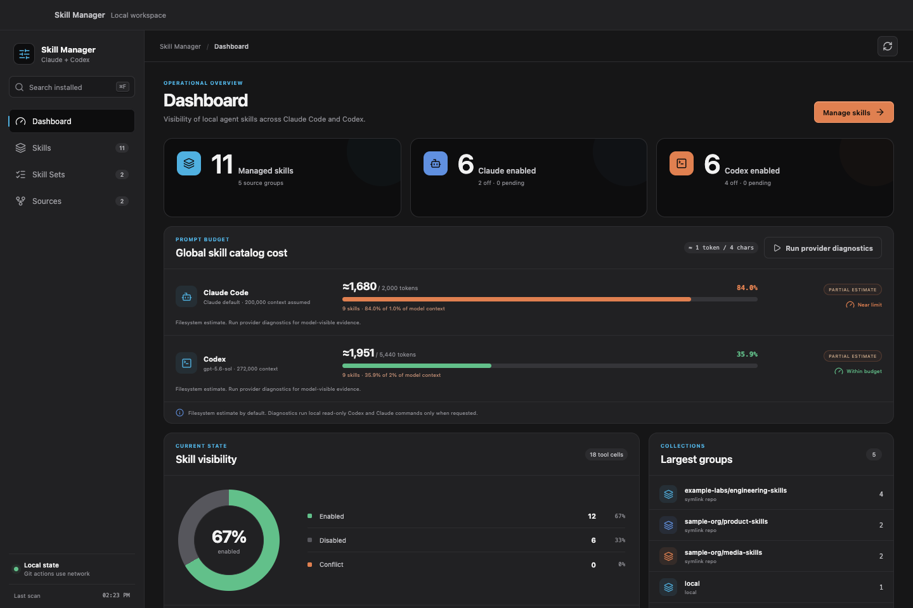
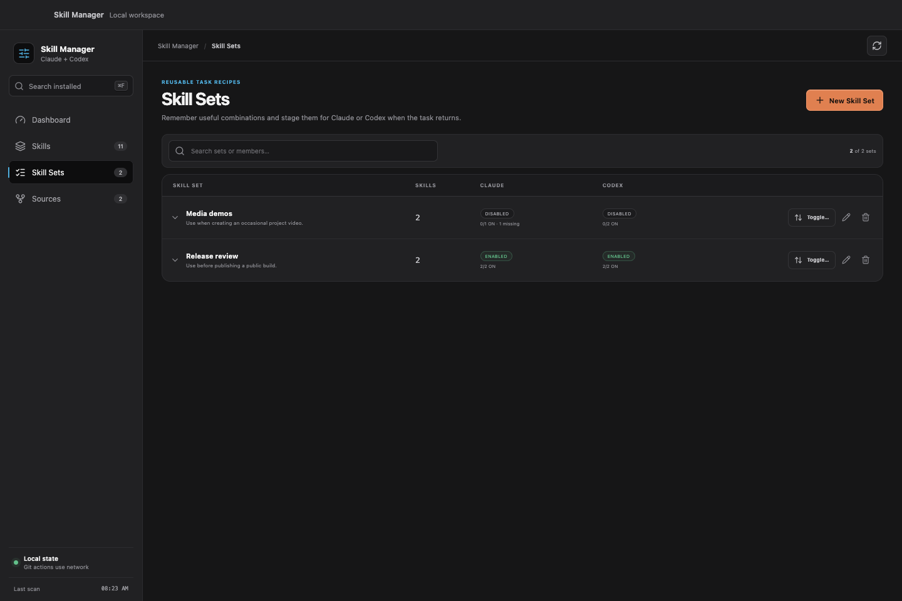

# Skill Manager

Skill Manager gives Claude Code and Codex users one local place to see, install,
and reversibly control Agent Skills across both tools. Turning a skill off
removes it from discovery without deleting or rewriting it; turning it on
restores the exact original directory or symlink.

<p align="center">
  <a href="https://github.com/dees91/agent-skill-manager/releases/tag/v0.4.2">Download macOS app</a>
  ·
  <a href="#installation-from-source">Install CLI</a>
  ·
  <a href="#status-and-compatibility">Compatibility</a>
</p>

<p align="center">
  
</p>

## Why Skill Manager

- See one live inventory across Claude Code and Codex.
- Hide and restore the exact original skill entry with reversible toggles.
- Preserve Git repositories, linked folders, lockfiles, and skill contents.
- Use the same safety model from the macOS app, TUI, or CLI.
- Stay local-first, with no telemetry or background polling.

## Status And Compatibility

The current source version is `0.4.2` and is a public preview, not a stable
release.

- The supported desktop target is Apple Silicon macOS 13 or newer.
- The CLI and TUI are written in Go and can compile on other platforms, but
  filesystem behavior outside macOS is not part of the supported release
  contract yet.
- Provider locations are fixed relative to the current user's home directory.
  Custom Claude or Codex skill roots are not configurable in this version.
- Release downloads are built for Apple Silicon and ad-hoc signed, not
  Developer ID signed or notarized.
- Universal macOS binaries, DMG installers, auto-update, and telemetry are not
  included.

## Managed Paths

Skill Manager derives all paths from the current OS user's home directory:

| Purpose | Path | Behavior |
|---|---|---|
| Claude user skills | `~/.claude/skills` | Toggleable |
| Codex user skills | `~/.agents/skills` | Toggleable |
| Codex system skills | `~/.codex/skills/.system` | Read-only |
| Claude plugin cache | `~/.claude/plugins/cache` | Read-only |
| Skills CLI metadata | `~/.agents/.skill-lock.json` | Read-only source label |
| Skill Manager state | `~/.skill-manager` | Owned by Skill Manager |

Entries without a regular `SKILL.md` are hidden. The filesystem is rescanned
at startup, on explicit refresh, and after mutations; the manifest is not used
as a replacement for live discovery.

## Installation

### GitHub Release Preview

The [`v0.4.2` prerelease](https://github.com/dees91/agent-skill-manager/releases/tag/v0.4.2)
provides two Apple Silicon downloads:

- `skill-manager-desktop-0.4.2-macos-arm64.zip` contains `Skill Manager.app`;
- `skill-manager-cli-0.4.2-macos-arm64.tar.gz` contains the terminal binary,
  README, license, and third-party notices.

Download the matching archive together with `SHA256SUMS.txt`, then compare its
SHA-256 digest with the corresponding manifest line. For example:

```bash
shasum -a 256 skill-manager-desktop-0.4.2-macos-arm64.zip
grep 'skill-manager-desktop-0.4.2-macos-arm64.zip' SHA256SUMS.txt
```

The two hashes must be identical. The checksum detects an incomplete or
changed download; it is not a Developer ID signature or notarization ticket.

For the desktop app, expand the ZIP and move `Skill Manager.app` to
`/Applications`. On first launch, macOS may block the app because the preview
is not notarized. Control-click the app, choose **Open**, then confirm **Open**.
If that option is not offered, try once normally and use **System Settings →
Privacy & Security → Open Anyway** only after verifying the checksum and source.

For the CLI, extract the archive and install the executable on `PATH`:

```bash
tar -xzf skill-manager-cli-0.4.2-macos-arm64.tar.gz
install -m 0755 \
  skill-manager-cli-0.4.2-macos-arm64/skill-manager \
  "$HOME/.local/bin/skill-manager"
skill-manager --version
```

### Installation From Source

The terminal application requires Go 1.26.6 or newer:

```bash
go install github.com/dees91/agent-skill-manager@latest
```

Alternatively, clone and build it locally:

```bash
git clone https://github.com/dees91/agent-skill-manager.git
cd agent-skill-manager
make build
./bin/skill-manager help
```

`make dev` installs the current checkout at
`~/.local/bin/skill-manager`. Set `BIN` to choose another destination:

```bash
make dev BIN="$HOME/bin/skill-manager"
```

### Building The Desktop Application

The desktop build requires Go 1.26.6 or newer, Node.js 22.12 or newer with npm
10 or newer, Xcode command-line tools, and network access for dependency
installation:

```bash
make gui-test
make gui-build
open "desktop/build/bin/Skill Manager.app"
```

The result is a local ad-hoc-signed `darwin/arm64` app. Because it is not
notarized, macOS may require explicit approval before the first launch.

## Terminal Interface

Running without a subcommand opens the TUI:

```bash
skill-manager
skill-manager tui
```

Read-only commands:

```bash
skill-manager version
skill-manager list
skill-manager status
skill-manager groups
skill-manager repos
```

Toggle one managed skill:

```bash
skill-manager disable --tool claude example-skill --dry-run
skill-manager disable --tool claude example-skill
skill-manager enable --tool claude example-skill
```

Install all valid skills from a Git repository, or select specific skills and
tools:

```bash
skill-manager install https://github.com/example/agent-skills --dry-run
skill-manager install https://github.com/example/agent-skills --tool both
skill-manager install git@github.com:example/agent-skills.git --tool codex --skill example-skill
```

Install a user-owned folder link-in-place:

```bash
skill-manager install ~/Developer/example-skills --tool both
skill-manager install ./skills --tool claude --skill example-skill --dry-run
```

Update or uninstall a complete recorded source:

```bash
skill-manager update --dry-run
skill-manager update https://github.com/example/agent-skills
skill-manager uninstall https://github.com/example/agent-skills --dry-run
skill-manager uninstall ~/Developer/example-skills --dry-run
```

Git repository update is fast-forward-only and requires a clean, audited
checkout. Local path sources are live links and therefore do not have an update
operation. Uninstall always removes a complete recorded source; individual
skill uninstall is not supported.

### TUI Controls

| Key | Action |
|---|---|
| `Tab` | Switch active tool column |
| `Up`/`Down` or `k`/`j` | Move selection |
| `Space` | Stage or unstage the active-cell toggle |
| `b` | Smart-toggle both cells in the row |
| `g` | Smart-toggle the selected source group |
| `A` | Smart-toggle all visible eligible cells |
| `G` | Cycle group filter |
| `/` | Edit text filter |
| `s` | Cycle source filter |
| `o` | Show or hide read-only skills |
| `d` | Show or hide details |
| `u` / `U` | Undo one / clear all pending changes |
| `a` or `Enter` | Apply the pending batch |
| `r` | Rescan |
| `q` | Quit, with a warning for pending changes |

## Desktop Interface

The macOS source build exposes four views over the same Go domain services as
the CLI and TUI:

- **Dashboard** summarizes managed visibility, groups, conflicts, and an
  approximate global skill-catalog context budget for each provider.
- **Skills** keeps active skills expanded, groups inactive skills by source,
  and stages reversible toggles for explicit review and Apply.
- **Skill Sets** remembers task-oriented combinations, including an optional
  **When to use** note, and stages them for Claude, Codex, or both.
- **Sources** installs exact Claude/Codex skill cells and safely updates or
  uninstalls complete Git and local sources recorded in the manifest.





The experimental skills.sh Discover implementation remains under development
and is not exposed by the `v0.4.2` public preview build.

Pending skill toggles remain process-local until Apply. Source lifecycle
operations are separately confirmed and cannot overlap a pending toggle batch.
The frontend submits identifiers and tool names; filesystem paths and planned
operations are resolved and validated in Go.

Skill Sets are overlapping recipes, not active profiles. Each use asks for a
tool scope and follows the same Pending/Apply boundary as ordinary toggles.
Missing members remain in the recipe and reconnect when a skill with the same
basename is installed again. The CLI and TUI do not manage Skill Sets yet.

## State And Safety Model

Skill Manager keeps its state under `~/.skill-manager/`:

```text
~/.skill-manager/
  state.json
  skill-sets.json
  backups/
  cache/skills-sh/catalog-v1.json
  disabled/claude/
  disabled/codex/
  repos/
  trash/
```

Important invariants:

- Disable and enable move the original entry; symlinks are never dereferenced.
- Restore and install never overwrite, merge, rename, or delete a blocker.
- Existing state is backed up before the first mutation in a process.
- Skill Set metadata uses a separate atomic, owner-only file and bounded
  `skill-sets-*.json` backups, so malformed recipe data does not block normal
  skill scanning and toggles.
- State directories are restricted to the current user. State/cache JSON files
  use mode `0600`; state backups retain at most 10 files and 30 days.
- Failed batch apply stops at the first error and preserves the completed
  prefix in state.
- Git uninstall validates owned links and checkout safety before staging and
  removing them.
- Local-source uninstall never stages, edits, moves, or deletes the source
  folder.
- Skill Manager does not edit `SKILL.md`, provider plugin caches, or external
  manager lockfiles.
- `--dry-run` is available for every mutating CLI command.

Installed skills contain instructions that an agent may follow. Skill Manager
does not audit or sandbox third-party skill contents; review a source before
installing it.

## Network And Privacy

There is no telemetry, account system, analytics SDK, or background polling.
Network access occurs only for an explicit Git source operation:

- Git invokes the local `git` executable to clone, fetch, and fast-forward
  user-selected repositories.
- The Dashboard uses filesystem estimates by default. Its explicit **Run
  provider diagnostics** action may invoke installed `claude` and `codex`
  binaries with fixed read-only arguments. Failure degrades to an estimate.

See [PRIVACY.md](PRIVACY.md) for the complete data-flow description and
[SECURITY.md](SECURITY.md) for vulnerability reporting.

## Development

```bash
go test ./...
make test-all
make gui-build
```

`make test-all` installs the exact frontend dependencies, runs typecheck and
frontend tests, builds `frontend/dist`, and only then compiles the embedded
desktop module. This ordering intentionally verifies the same dependency that
a fresh clone has.

Backend tests use temporary home directories and local/fake Git repositories.
They must never point at the real global provider directories. Frontend tests
use an in-memory backend with synthetic data.

Read [CONTRIBUTING.md](CONTRIBUTING.md) before submitting changes. The
LLM-maintained engineering wiki starts at [docs/wiki/index.md](docs/wiki/index.md),
while [AGENTS.md](AGENTS.md) remains the product and safety contract.

## License

Skill Manager is available under the [MIT License](LICENSE). Binary
distributions include [third-party license notices](THIRD_PARTY_NOTICES.txt).
